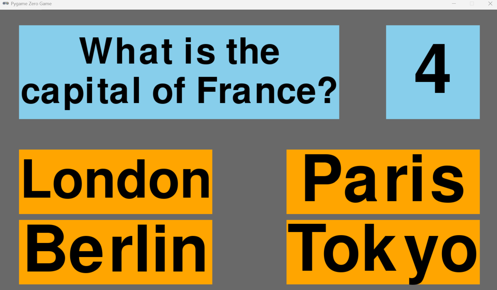

#  Quiz Game

A simple multiple-choice quiz game built using [Pygame Zero](https://pygame-zero.readthedocs.io/en/stable/). The game displays one question at a time and gives players 10 seconds to answer. It’s designed to demonstrate basic game logic, UI rendering, and event handling in Python.



---

##  Features

- Multiple choice quiz questions
- Countdown timer for each question
- Score tracking
- Game over screen when time runs out or all questions are answered

---

##  File Structure

QuizGame/
├── QuizGame.py           # Main Python file containing the game logic
├── images/
│   └── Screenshot1.png   # Screenshot of the game
└── README.md             # Project documentation


---

##  Getting Started

### Prerequisites

Make sure you have Python installed (3.6 or higher recommended), and install **Pygame Zero**:

```bash
pip install pgzero
````

### Running the Game

To run the game, navigate to the project directory and use:

```bash
pgzrun QuizGame.py
```

---

##  Screenshot


---

## 🛠 Technologies Used

* Python 3
* [Pygame Zero](https://pygame-zero.readthedocs.io/)


##  Ideas for Expansion

* Add sound effects for correct/incorrect answers
* Load questions from an external file (e.g., JSON or CSV)
* Track high scores
* Add difficulty levels or categories


##  Author

John McGinnes

```

